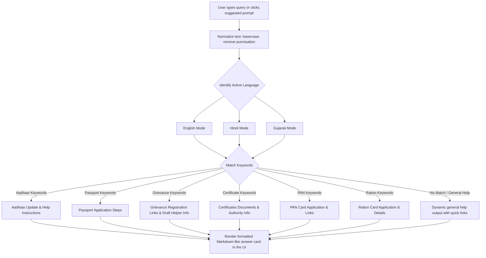

# Prompt Workflow & AI Simulation Strategy
**Smart Bharat – AI-Powered Civic Companion**

This document outlines the workflow, architecture, and prompt logic used to simulate the GenAI assistant client-side and manage interactive states in the "Smart Bharat" web app.

## 1. AI Simulation Strategy
Since the application runs frontend-first (allowing instant load and offline execution without external API latency or billing requirements), we implement a **Smart Civic Rule Engine** in JavaScript. 

The strategy mimics a semantic classifier and dynamic translator:
1. **Normalization:** The engine normalizes user inputs (lowercases text, removes punctuation, trims whitespace).
2. **Intent Classification:** It scans for key vocabulary across three primary vectors:
   - **Identity/Aadhaar:** `aadhaar`, `uidai`, `card`, `aadhar`, `address update`, `dob`, `phone`
   - **Travel/Passport:** `passport`, `pass`, `visa`, `travel`, `appointment`
   - **Legal/Certificates:** `birth certificate`, `death certificate`, `marriage`, `caste`, `income`, `certificate`
   - **Complaint/Grievance:** `complaint`, `grievance`, `report`, `road`, `leak`, `pothole`, `garbage`, `street light`
   - **Taxes/PAN:** `pan`, `tax`, `income tax`, `pan card`
   - **Ration:** `ration`, `food security`, `ration card`, `card status`
3. **Response Assembly:** Depending on the selected active language (English, Hindi, Gujarati), it references a multi-layered dictionary object to compile natural-sounding, contextually helpful answers.
4. **Fallback Handling:** If no keyword matches, the engine falls back to a generalized helpful response, suggesting sample prompts that the user can click to get immediate guidance.

## 2. Interactive UI State Workflows

To enhance the visual fidelity of the simulated ecosystem, three state workflows are linked directly to user inputs:
- **Checklist Progress State:** Checklist items use a sibling selector CSS state (`.checklist-checkbox:checked + .checklist-text`) to perform real-time visual strikes and dimming when documents are marked as prepared.
- **Dynamic Grievance Tracker State:** Newly registered complaints are pushed into `state.complaints` and stored in `localStorage`. They are immediately appended as clickable pills under the tracker search box, permitting one-click progression inspection.
- **Unified App Reset Flow:** Clicking the brand logo logo triggers an application-wide reset handler returning the active language to English, emptying input forms, closing active AI cards, and loading default sample tracking states.

## 3. Prompt Workflow Diagram (Mermaid)

## 4. Predefined Prompt Suggestions
To lower the entry barrier for citizens, the UI displays quick-click prompts:
- *English:* "How do I update my Aadhaar address?" / "What is the procedure for a Passport?" / "Where do I report a local street light issue?"
- *Hindi:* "आधार कार्ड में पता कैसे बदलें?" / "पासपोर्ट बनवाने की प्रक्रिया क्या है?" / "स्थानीय शिकायत कहाँ दर्ज करें?"
- *Gujarati:* "આધાર કાર્ડમાં સરનામું કેવી રીતે બદલવું?" / "પાસપોર્ટ બનાવવાની પ્રક્રિયા શું છે?" / "સ્થાનિક ફરિયાદ ક્યાં કરવી?"

When clicked, these immediately trigger the mock GenAI assistant, demonstrating rapid response capabilities.
