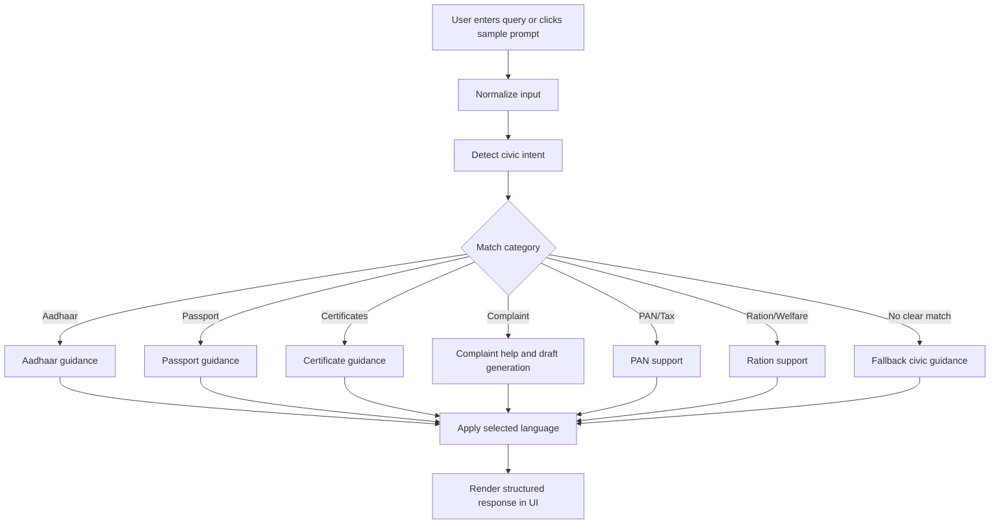

# Prompt Workflow & AI Assistance Strategy
## Smart Bharat – AI-Powered Civic Companion

This document explains how Smart Bharat simulates a multilingual civic AI assistant to help citizens understand government services, identify required documents, draft complaints, and track grievance-related actions.

## 1. Objective

The AI assistance layer is designed to solve four core civic problems:

1. Simplifying complex government information into plain language.
2. Guiding users toward relevant public services and complaint channels.
3. Generating structured complaint drafts from user input.
4. Supporting multilingual access in English, Hindi, and Gujarati.

Because the project is built as a frontend-first deployable prototype, the AI behavior is implemented through a lightweight client-side civic rule engine in JavaScript.

## 2. Prompt Workflow Logic

The assistant follows a structured interaction pipeline:

1. **User Input Capture**  
   The user types a civic query or clicks a suggested prompt.

2. **Normalization**  
   The input is normalized by converting text to lowercase, trimming spaces, and removing punctuation.

3. **Intent Detection**  
   The system checks the query for service-related keywords across major civic categories:
   - Aadhaar and identity services
   - Passport and travel services
   - Certificates and official records
   - Public grievance and complaint reporting
   - PAN and tax-related support
   - Ration and welfare-related support

4. **Language Mapping**  
   The response is prepared in the currently selected language:
   - English
   - Hindi
   - Gujarati

5. **Response Construction**  
   The app generates a structured, user-friendly response containing:
   - a simplified explanation,
   - next-step guidance,
   - relevant document hints,
   - and official service direction where applicable.

6. **Fallback Support**  
   If the query does not clearly match a known category, the assistant provides a general civic-help response along with example prompts for faster guidance.

## 3. Complaint Assistance Workflow

For grievance support, the app uses a separate structured flow:

1. User selects complaint category.
2. User enters location and issue details.
3. The system generates a formal complaint draft in a professional format.
4. The complaint is stored locally for demo tracking.
5. A mock status timeline helps the user understand the grievance progression flow.

## 4. Document Guidance Workflow

For service-related document help:

1. User selects a service such as Aadhaar update, Passport, PAN, or Certificate request.
2. The app loads a contextual checklist of primary and supporting documents.
3. Users can mark documents as prepared for a more interactive experience.

## 5. Multilingual Strategy

To promote accessibility and inclusion, Smart Bharat supports multilingual civic assistance in:
- English
- Hindi
- Gujarati

All assistant responses, prompt suggestions, and civic guidance are mapped through localized response objects to keep the user experience consistent across languages.

## 6. Suggested Prompt Strategy

The interface lowers the barrier for first-time users through clickable civic prompts such as:

- “How do I update my Aadhaar address?”
- “What documents are needed for a passport?”
- “Where can I report a pothole or street light issue?”
- “How do I apply for a birth certificate?”
- “How can I check my grievance status?”

These sample prompts make the app immediately usable even for users unfamiliar with formal government terminology.

## 7. Why This Approach Was Chosen

This AI assistance approach was selected because it provides:
- fast response time,
- zero external API dependency,
- simple deployment,
- multilingual civic accessibility,
- and a reliable hackathon-ready prototype experience.

It demonstrates how Generative AI-inspired interaction design can make public service navigation easier, clearer, and more inclusive for citizens.

## 8. Workflow Diagram

